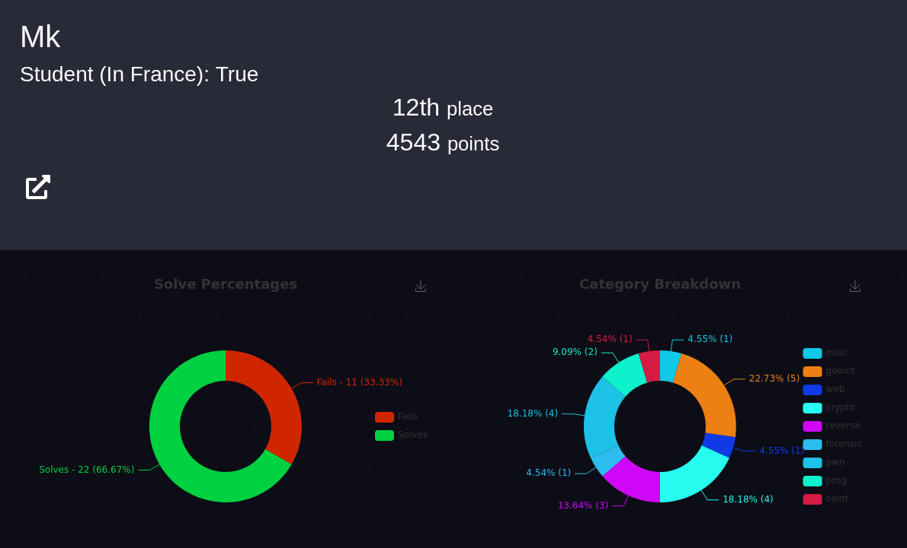

# CTF PWNME 2022

CTF sous format court (72h) organisé par l'école 2600 entre les 1er et 4 juillet 2022.

Merci aux organisateurs pour ces challenges, et ce CTF qui s'est bien déroulé sans problèmes de disponibilité particuliers.

#### Forensic
- [Chat](forensic/cat_story)

#### GEOINT
- [Vacances](geoint/vacances)
- [Attrapez le](geoint/attrapez_le)

#### Crypto
- [To basics](crypto/to_basics)
- [RSA Madness](crypto/rsa_madness)
- [Encrypted communication](crypto/crypted_com)
- [Exponential machine](crypto/exponential_machine)

#### Programmation
- [On my way 1/3](prog/way_1)
- [On my way 2/3](prog/way_2)

#### Reverse
- [It's easy](reverse/easy)
- [Depycted](reverse/depycted)
- [Crackme](reverse/crackme)

#### Pwn
- [0xb0f](pwn/0xb0f)
- [0x00b](pwn/0x00b)
- [Free Win](pwn/free_win)
- [Off the road](pwn/off_road)

## End Game

  

