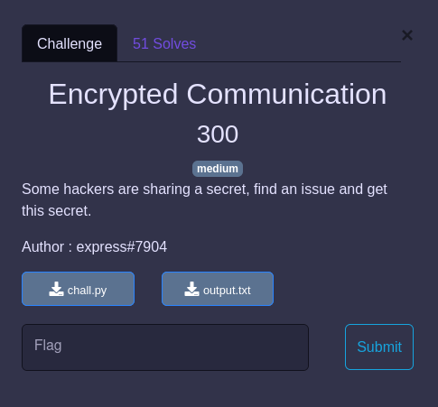

## CRYPTO / Encrypted Communication


<p align="center">
  
</p>


Deux fichiers nous sont fournis :
- [chall.py](chall.py)
- [output.txt](output.txt)


### Solve


Problème :

```python
p, q, s = getPrime(2048), getPrime(2048), getPrime(2048)
n1 = p * q
n2 = s * p
```

Nous avons deux messages chiffrés avec deux clefs publiques `(e,n1)` et `(e,n2)` différentes .... En revanche `n1` et `n2` partagent un entier premier générateur commun : `p`.

Il est du coup assez trivial de le retrouver : `p = GCD(n1,n2)` et de là reconstruire les deux clefs privées permettant de déchiffrer les deux morceaux du flag.

```python
from binasciifrom Crypto.Util.number import *
import unhexlify

p = GCD(n1,n2)
q = n1//p
s = n2//p
d1 = pow(e, -1, (p-1)*(q-1))
d2 = pow(e, -1, (p-1)*(s-1))
flag1 = pow(c1,d1,n1)
flag2 = pow(c2,d2,n2)
print(unhexlify(hex(flag1)[2:]),unhexlify(hex(flag2)[2:]) )
``̀`

`b'PWNME{bef3c2b127e9d4' b'f64a4f6a84ad6d0b32f}'`
