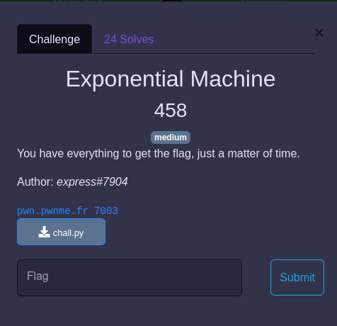

## CRYPTO / Exponential machine


<p align="center">
  
</p>


Un fichier nous est fourni :
- [chall.py](chall.py)


### Challenge

```python
a = getPrime(512)
x = bytes_to_long(b"PWNME{FAKE_FLAG}")
n = getPrime(512)
print("(a**x) % n =", str(pow(a,x,n)), "\n")
```

Le flag sert de clef pour chiffrer (RSA like) un message connu, il nous faut retrouver cette clef (et donc le flag).

Heureusement un oracle propose d'éffectuer pour nous des opérations : `+ - * // **` sur cette clef et de nous retourner le nouveau message chiffré.


### Solution

L'idée va être de bruteforcer la chiffre par chiffre, en utilisant la division entière par des multiples de 10.

Par exemple si la clef est `2345678901` :
- on va demander à l'oracle de chiffrer le message avec `clef // 100000000 = 2`
- en parallèle on va chiffrer le message `a**i [n]` avec `i` entre 0 et 9 et comparer les chiffrés obtenus pour trouver le premier chiffre de la clef est `2`
- ensuite on recommence avec `clef // 10000000  = 23`
- en parallèle on va chiffrer le message avec `a**(2*10 + i) [N]` avec `i` entre 0 et 9 et comparer les chiffrés obtenus pour trouver le 2e chiffre de la clef : `3`

Et ainsi de suite.

Contrairement à l'énoncé on a pas 30 mais 64 essais (cf boucle `while` du code).

En faisant quelques essais, on trouve que la clef est de longueur `10**93`, en effet `10**94` renvoie `1`.

C'est à dire que `flag // 10**94 = 0`.

Comme on a pas assez de tentatives, on va non pas bruteforcer chiffre par chiffre, mais deux chiffres par deux chiffres.

Jusqu'au dernier, qu'il faudra chercher cette fois avec une addition de `1` en `1` :

Le code : [solve.py](solve.py)

```python
flag = 0
  i = 93
  exp = 10**i

  while(exp!=1):

      exp = 10**i
      if exp < 10:
          exp = 1

      rep = send_bytes(s, '/')

      rep = send_bytes(s, str(exp))

      result = rep.decode().split('\n\n')[0]
      result = int(result.split(' : ')[1])


      for j in range(100):
          tmp = flag * 100 + j
          if pow(a,tmp,n) == result:
              flag = tmp
              print(flag)
              i=i-2
              break

  flag = flag * 10


  # find the last digit
  for j in range(10):

      tmp = flag + j
      if pow(a,tmp,n) == result:
          flag = tmp
          break

  print(long_to_bytes(flag))
```

```bash
python3 solve.py                                                                                                                                                                                                         ✔  12:22:32 
a = 6926513502288242453382618702654229643367807346032307347298860421382070366533604821103670471961411703433758401375093626656438902821588227013608809911314769
n = 8865505188982262766332838893879319620692455134709869083972135434711594313311921901779514783802221726301317006965617598681279335797259699557588320590123677
c = 3921948475598550333089174454270445552454670465113959618344184193321247290714431149222955785654861469831876454713574665725195043712480472009114133860462600
2
261
26185
2618521
261852137
26185213741
2618521374154
261852137415466
26185213741546679
2618521374154667937
261852137415466793770
26185213741546679377002
2618521374154667937700237
261852137415466793770023754
26185213741546679377002375458
2618521374154667937700237545820
261852137415466793770023754582076
26185213741546679377002375458207632
2618521374154667937700237545820763222
261852137415466793770023754582076322276
26185213741546679377002375458207632227642
2618521374154667937700237545820763222764270
261852137415466793770023754582076322276427042
26185213741546679377002375458207632227642704247
2618521374154667937700237545820763222764270424716
261852137415466793770023754582076322276427042471663
26185213741546679377002375458207632227642704247166320
2618521374154667937700237545820763222764270424716632016
261852137415466793770023754582076322276427042471663201664
26185213741546679377002375458207632227642704247166320166432
2618521374154667937700237545820763222764270424716632016643209
261852137415466793770023754582076322276427042471663201664320997
26185213741546679377002375458207632227642704247166320166432099745
2618521374154667937700237545820763222764270424716632016643209974500
261852137415466793770023754582076322276427042471663201664320997450098
26185213741546679377002375458207632227642704247166320166432099745009849
2618521374154667937700237545820763222764270424716632016643209974500984977
261852137415466793770023754582076322276427042471663201664320997450098497741
26185213741546679377002375458207632227642704247166320166432099745009849774122
2618521374154667937700237545820763222764270424716632016643209974500984977412275
261852137415466793770023754582076322276427042471663201664320997450098497741227505
26185213741546679377002375458207632227642704247166320166432099745009849774122750549
2618521374154667937700237545820763222764270424716632016643209974500984977412275054927
261852137415466793770023754582076322276427042471663201664320997450098497741227505492786
26185213741546679377002375458207632227642704247166320166432099745009849774122750549278602
2618521374154667937700237545820763222764270424716632016643209974500984977412275054927860282
261852137415466793770023754582076322276427042471663201664320997450098497741227505492786028249
b'PWNME{68dab83e7f2664361e701f5d82bd9be4}'
```
