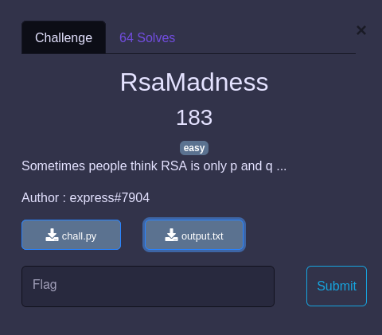

## CRYPTO / RSA Madness


<p align="center">
  
</p>


Deux fichiers nous sont fournis :
- [chall.py](chall.py)
- [output.txt](output.txt)


### Solve

Nous avons un chiffrement du flag mais avec un modulus N faible, normalement `N = p * q` où `p` et `q` sont de entiers premiers de grande taille.

La robustesse de RSA reposant principalement sur la difficulté à factoriser N pour retrouver ses entiers générateurs.

Dans le chall, `N` est le produit de 32 entiers premiers de 32 bits.

Du coup on devrait pouvoir le factoriser facilement et calculer la clef privée (inverse modulaire de e modulo phi(n)).

Cela se fait bien avec Sage, même en ligne si on ne veut pas l'instlaller (c'est assez lourd !) : https://sagecell.sagemath.org/

```python
n = 7119541149326911263846237336068827035426390978903518184071800577216994524551352495493081918851614130414331517984836350572442636378573029918244826773120934619489882189716217950746021474614776218719283095363211027209022463670918163108226484066350208938841262463820714679754689007199511102068228362022891339
e = 65537
c = 2677813284789904126438760381359441846563302259269282617284434686954175401256426228859726004471829287478436507358546887844300713181475644091802430738029057414949633797451370298947353237612172383915668526623229664084518635473132876673558581857332713891368639409620521533432667125874667705549410188263908117

factor(n)
ep = eleur_phi(n)
d = inverse_mod(e,ep)
flag = pow(c,d,n)
flag
```
Cela donne : `670341471783596413955419424902624515406999754068578270776675909325692471691745928915117688251261`


```python
from binascii import unhexlify
unhexlify(hex(670341471783596413955419424902624515406999754068578270776675909325692471691745928915117688251261)[2:])

b'PWNME{f02368945726d5fc2a14eb576f7276c0c}'
```
