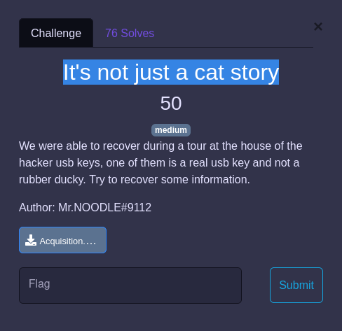
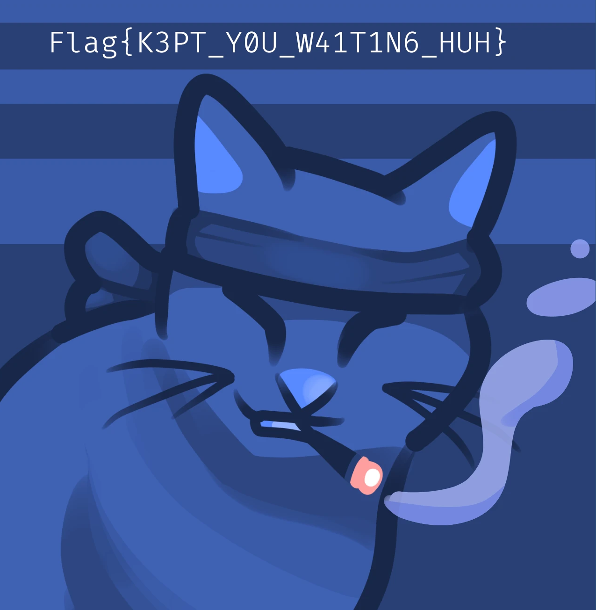

## FORENSIC / It's not just a cat story


<p align="center">
  
</p>


## Challenge

Un dump d'une clef USB nous est fournit : [Acquisition](Acquisition.e01)

Selon l'extension (confirmé avec un `file`) le dump a été réalisé au format `ewf`

```
$ file Acquisition.e01
Acquisition.e01: EWF/Expert Witness/EnCase image file format
```

On va pouvoir la monter avec `ewf-tools`: https://andreafortuna.org/2018/04/11/how-to-mount-an-ewf-image-file-e01-on-linux/


Ensuite il suffit de passer `photorec` sur l'image disque pour extraire 3 fichiers images dont le flag


<p align="center">
  
</p>
