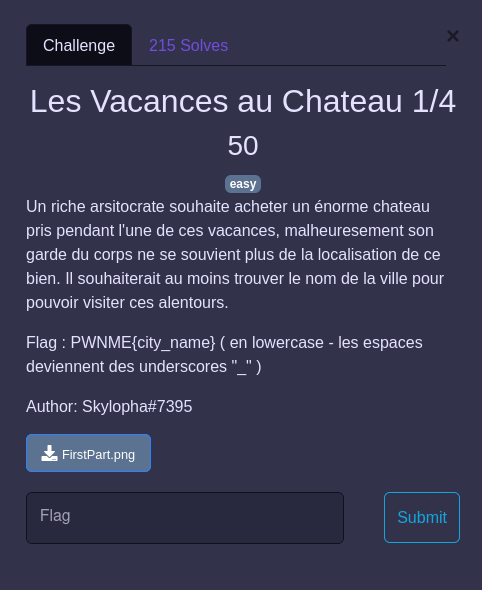
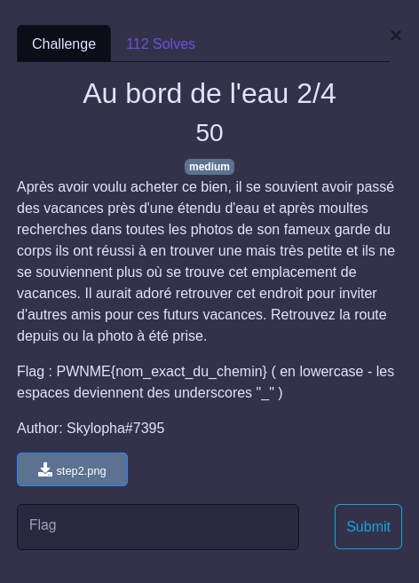
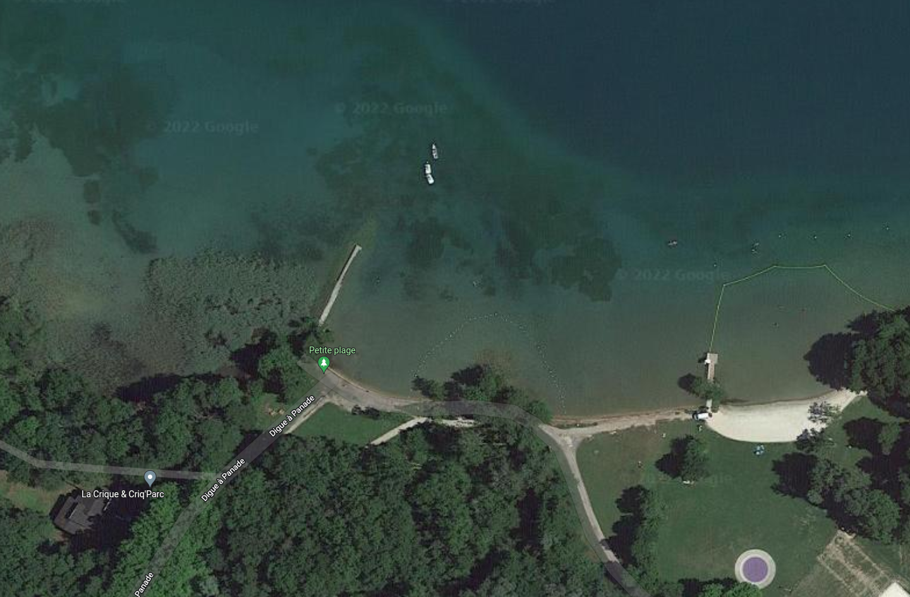
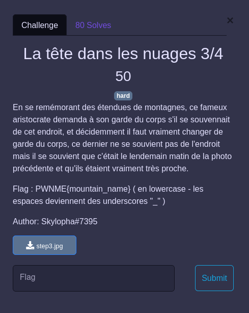
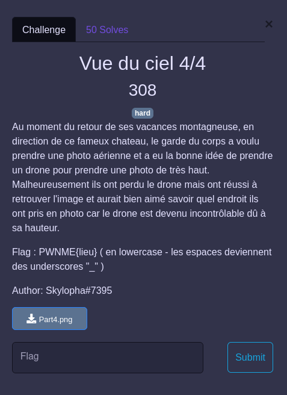
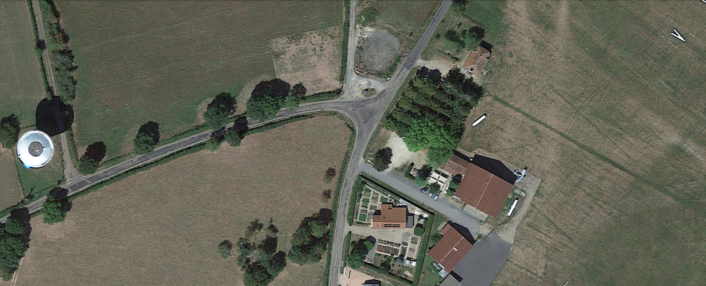

## GEOINT / Sur la route des vacances

## Step 1

  

  

En uploadant l'image dans une page Google de recherche par image, le résultat est immédiat : `chateau d'Amboise` (près de Tours)

## Step 2

  

  

En regardant l'image on peut remarquer :
- les montagnes
- le lac
- les bateaux (base nautique ?)
- le village/la ville en fond avec de "beaux" bâtiments

Il suffit de quelques recherches pour penser au lac d'Annecy, qu'un petit tour sur Google Maps confirme rapidement, on retrouve la plage sur la rive Sud Ouest du lac d'Annecy, et la route : `Digue à panade`

  

## Step 3

  

  

L'image semble prise depuis un chemin de randonnée aux environs d'Annecy et du lieu de l'étape précédente (cf indice du chall).

On remarque la zone déboisée au premier plan, il faut alors se promener un peu sur Google Maps pour trouver : le mont `Semnoz` au Sud Ouest du lac.

## Step 4

  

  

On peut supposer qu'il s'agit d'un petit aérodrome, avec une piste en herbe (on voit un bout de signalisation de début de piste le "V" blanc)

Par ailleurs, le type était en chemin entre Annecy et Tours. Rechercher tous les aéro club sur Maps est assez pénible, heureusement on peut trouver : https://map.aerobreak.com/

Qui épingle tous les aérodromes en France, en plus chaque punaise ouvre une peite fiche avec des photos, ainsi en se dirigeant le long de l'itinéraire on trouve le notre à Paray-le-Monial.

Juste, il m'a fallut quelques tentatives avant d'entrer correctement le flag (reprendre dans Maps le label du lieu.)
