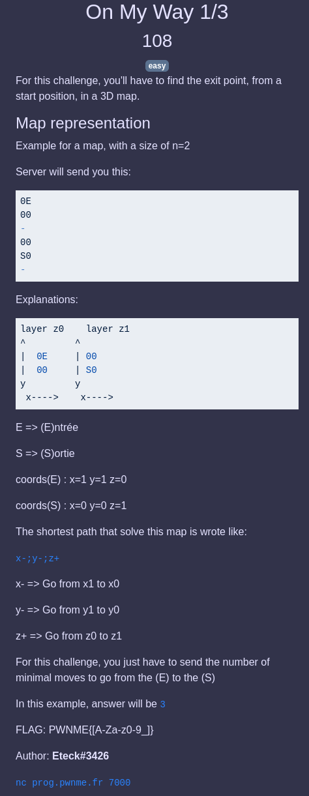

## PROG / On my way 1/3

  

### Challenge

Le but est de calculer la distance en `(x,y,z)` entre l'entrée `(xe,ye,ze)` et la sortie `(xs,ys,zs)`.

### Solution

Il suffit donc de calculer les distances `xe-xs`, `ye-ys` et `ze-zs`, puis d'additionner tout ça en valeurs absolues.

Code : [way1.py](way1.py)
