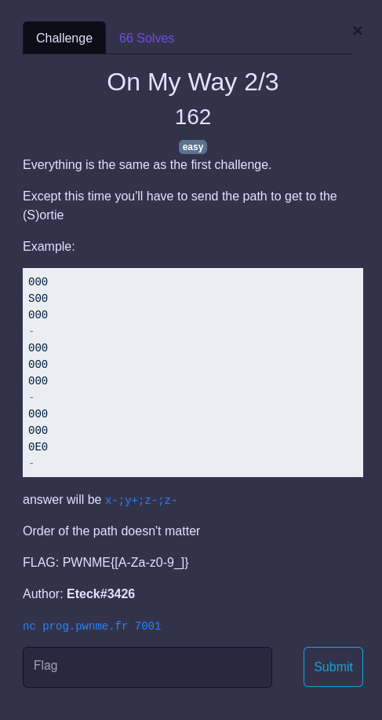

## PROG / On my way 2/3

  

### Challenge

Le but est de renvoyer l'itinéraire entre l'entrée `(xe,ye,ze)` et la sortie `(xs,ys,zs)`.

### Solution

Comme l'ordre des mouvements n'a pas d'importance, il suffit de reprendre le code du niveau 1 et de l'adapter un peu pour remplacer les distances par le nombre de mouvements `x- x+ y- y+ z- z+`.

Cette fois le sens `E -> S` a une importance, d'où les petites magouilles dans les indices `i` et `j` (abscisses et ordonnées) dans mon code, car dans le challenge l'origine du repère est en bas à gauche, et que je traite des tableaux doubles entrées dans le code et que je considère l'origine en haut à gauche.

Code : [way2.py](way2.py)
