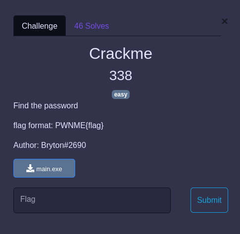

## REVERSE / Crackme

<p align="center">
  
</p>


Fichier : [main.exe](main.exe)

### Challenge

Il s'agit d'un crackme sous windows (ça commence mal):

```bash
$ file main.exe
main.exe: PE32+ executable (console) x86-64, for MS Windows
```

### Options

A ce stade plusieurs possibilités :
- décompiler le binaire et recoder les fonctions nécessaires à retrouver le flag ;
- analyser dynamiquement le binaire et retrouver le flag en mémoire.


### Solve

Comme je suis un peu flemmard je suis parti sur l'option deux, qui finalement m'a fait perdre pas mal de temps pour installer l'environment nécessaire :
- VM windows 8 server
- IDA
- un débugger (installer les debugging tools de windows et utiliser dbgsrv.exe)

*Je n'ai pas de captures du processus sous la main pour faire une soluce propre*

Mais :
- trouver le test qui vérifie la longeur de l'input (de tête 20 octets il me semble)
- trouver le `cmp` qui teste la valeur de l'input avec le flag octet par octet et mettre un beakpoint dessus
- patcher l'instruction suivante : `jz` en `jnz`, comme ça avec un input invalide la boucle va continuer sur tous les octets
- lancer le binaire en débug dans IDA (faut préciser dans le menu patch que l'on lance la version patchée)
- à chaque itération de la boucle noter la valeur contenu dans le registre contenant le flag


```
2c  l
f1  1
2e  n
2b  k
f3  3
24  d
1f  _
2c  l
f1  1
33  s
34  t
1f  _
f1  1
2e  n
1f  _
2d  m
f3  3
2d  m
f0  0
32  r
    y

PWNME{l1nk3d_l1st_1n_m3m0ry}
```

### TIPS

Certaines valeurs sont négatives, et du coup stockée en binaire sous la forme : `0xffffff3` par exemple.

Comme je n'arrive jamais à faire la conversion unsigned int vers int, j'ai fait un bout de C :

```c
#include <stdio.h>
#include <stdlib.h>


int main(){

  for( int a=-20; a <1; a++){
    printf("Signed : %d %u %x\n",a,a,a);
    printf("Unsigned : %d %u %x\n",(unsigned int)a,(unsigned int)a,(unsigned int)a);
    printf("\n");
  }
  return 0;
}
```
