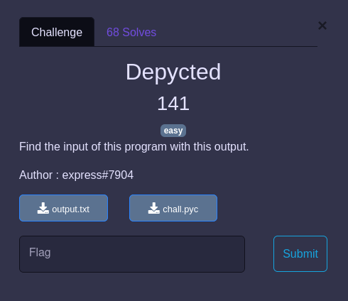

## REVERSE / Depycted


<p align="center">
  
</p>


### Challenge

Deux fichiers sont fournis :
- [chall.pyc](chall.pyc)
- [output.txt](output.txt)

Il s'agit alors de "reverser" le fichier `pyc` qui est du byte code python compilé, puis d'analyser le code pour en reverser l'algorithme et retrouver le flag dans `output.txt`

### Retrouver le code source

Pour le byte code python, il y'a des outils disponibles, mais aussi des décompilateurs en ligne : https://www.toolnb.com/tools-lang-fra/pyc.html


Ce qui donne :

```python
from Crypto.Util.number import long_to_bytes, bytes_to_long
from pwn import xor

def a(cipher):
    first = bytes_to_long(cipher[:16].encode()) ^ 13
    second = bytes_to_long(cipher[16:].encode()) ^ 37
    return (
     first, second)


def b(value1):
    first = str(value1)
    reverse_first = first[::-1]
    return reverse_first


def encrypt(flag):
    global a
    global b
    first, second = a(flag)
    print(b(first) + b(second))


flag = input("[+] Entre ton flag, que je l'encrypt avec mon chiffrement infaillible : ")
encrypt(flag)
```

### Inverser le code source

Le flag est :
- coupé en deux (on peut déjà supposer qu'il fait 32 octets)
- chaque moitié est converti en long, et xoré avec respectivemnent 13 et 37
- chaque moitié est écrite à l'envers et le tout est concaténé.

Le seul point délicat, que l'on ne connaît pas la longueur de chaque partie convertie en long, mais on peut bruteforcer en faisant les opérations inverses sur tous les découpages en 2 du chiffré :

- [0:1] et [1:n]
- [0:2] et [2:n]
- etc...

### Solve

Le code : [decrypt.py](decrypt.py)


```
$ python3 decrypt.py
b'PWNME{84ec5fec3e2ec91291bb74648d35dcbc4}'
```
