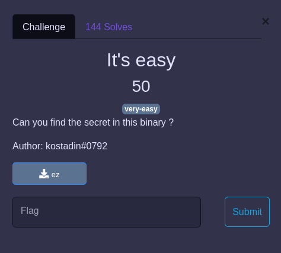

## REVERSE / It's easy

<p align="center">
  
</p>


Fichier : [ez](ez)

### Solve

Le flag est encodé en base64 en dur dans le binaire, on le retrouve facilement :

```
$ strings -10 ez | grep UF | base64 -d
PWNME{1ts_just_a_str1ng}
```
